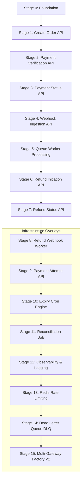
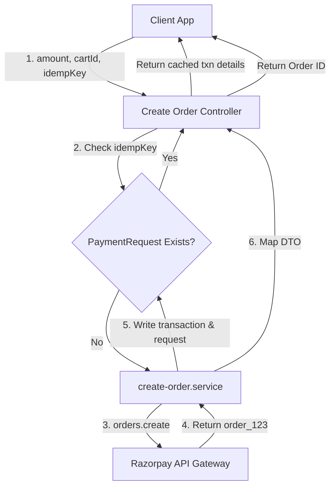
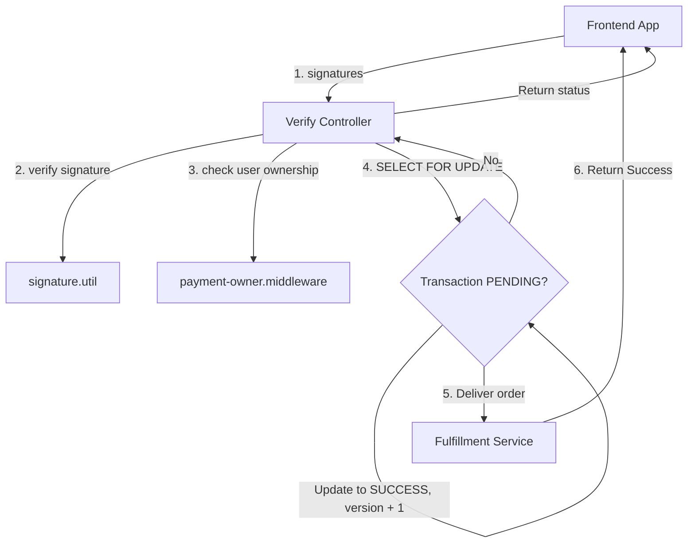
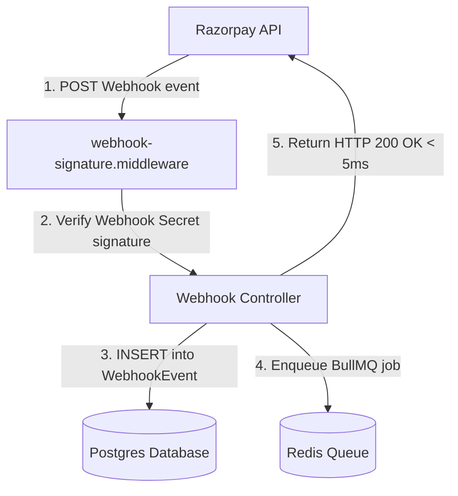
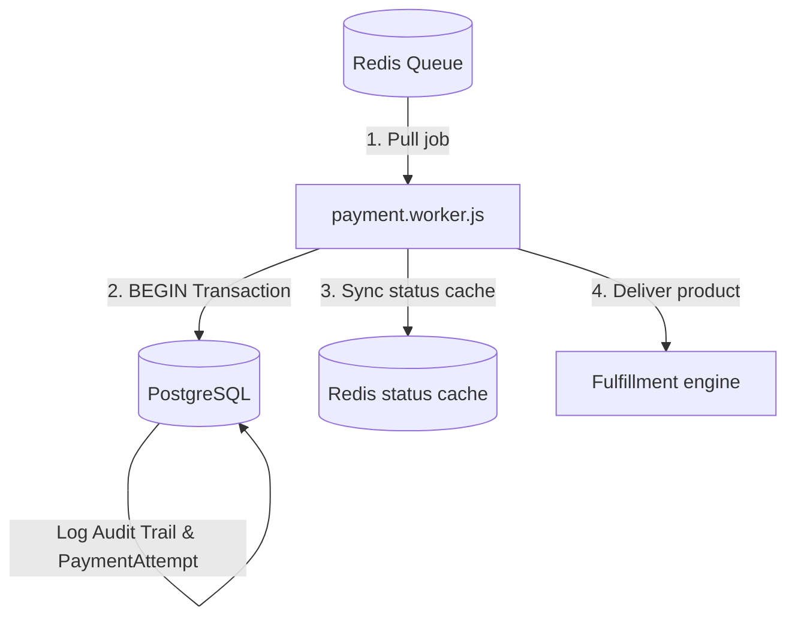

# Step-by-Step Payment Integration Development Roadmap (V1 & V2)

This document serves as the official step-by-step development roadmap for building a production-grade, high-scale (1000+ RPS) payment system. Instead of setting up directories all at once, this roadmap follows a chronological, dependency-driven order of development—building foundations first, followed by APIs, and finally infrastructure overlays.

---

## Roadmap Implementation Dependency Diagram



---

## Table of Contents
* [Stage 0 — Foundation & Setup](#stage-0--foundation--setup)
* [Stage 1 — Create Order API (`POST /create-order`)](#stage-1--create-order-api-post-create-order)
* [Stage 2 — Payment Verification API (`POST /verify-payment`)](#stage-2--payment-verification-api-post-verify-payment)
* [Stage 3 — Payment Status API (`GET /status/:orderId`)](#stage-3--payment-status-api-get-statusorderid)
* [Stage 4 — Webhook API (`POST /webhook`)](#stage-4--webhook-api-post-webhook)
* [Stage 5 — Worker Processing (`workers/payment.worker.js`)](#stage-5--worker-processing-workerspaymentworkerjs)
* [Stage 6 — Refund API (`POST /refund`)](#stage-6--refund-api-post-refund)
* [Stage 7 — Refund Status API (`GET /refund/:refundId`)](#stage-7--refund-status-api-get-refundrefundid)
* [Stage 8 — Refund Webhook Events](#stage-8--refund-webhook-events)
* [Stage 9 — Payment Attempt API (Optional)](#stage-9--payment-attempt-api-optional)
* [Stage 10 — Expiry Engine](#stage-10--expiry-engine)
* [Stage 11 — Reconciliation Engine](#stage-11--reconciliation-engine)
* [Stage 12 — Observability & Correlation Logs](#stage-12--observability--correlation-logs)
* [Stage 13 — Redis-Based Rate Limiting](#stage-13--redis-based-rate-limiting)
* [Stage 14 — Dead Letter Queue (DLQ)](#stage-14--dead-letter-queue-dlq)
* [Stage 15 — Multi-Gateway Abstraction (V2)](#stage-15--multi-gateway-abstraction-v2)
* [Summary of V1 API Endpoints](#summary-of-v1-api-endpoints)

---

## Stage 0 — Foundation & Setup

Before writing any client-facing endpoints, establish the infrastructure, package dependencies, and database schemas.

### 1. Goal
Set up the workspace environment, install key packages, establish the Postgres connection via Prisma, and initialize Redis and Razorpay credentials.

### 2. Implementation Steps
1. **Install Core Dependencies:**
   ```bash
   npm install @prisma/client bull ioredis razorpay express-rate-limit rate-limit-redis node-cron pino zod decimal.js
   ```
2. **Define Database Models:** Add `PaymentRequest`, `Transaction`, `PaymentAttempt`, `WebhookEvent`, `ProcessedWebhook`, `PaymentAudit`, and `Refund` tables to `prisma/schema.prisma`.
3. **Run Prisma Migrations:**
   ```bash
   npx prisma migrate dev --name create_payments_foundation
   ```
4. **Setup Shared Integrations:** Create `utils/redis.js` and `integrations/razorpay/razorpay.client.js` to manage singleton clients.

### 3. Verification criteria
* Verify database connection is active by running `npx prisma studio`.
* Verify Redis connection is online.

---

## Stage 1 — Create Order API (`POST /create-order`)

Everything starts from order creation. Without a backend order matching the Razorpay order ID, checkout redirects cannot proceed safely.

### 1. Logic Flow Diagram



### 2. Implementation Details
* **Route:** `POST /api/v1/payments/create-order`
* **Validation (`validations/create-order.validation.js`):** Enforce `user_id` (string), `amount` (positive float), `cart_id` (string), and `idempotency_key` (string).
* **Middleware (`idempotency.middleware.js`):** Intercept requests. If the `idempotency_key` matches an existing `PaymentRequest` record, immediately return the cached order response without hitting Razorpay.
* **Service Layer:**
  1. Call Razorpay SDK to create the order with `X-Razorpay-Idempotency-Key` header.
  2. Write transaction to Postgres with status `PENDING`, `expiresAt = now + 30 mins`, and `version = 1`.
  3. Respond with order ID, receipt, and correlation ID.

### 3. Verification criteria
* Test duplicate POST requests using Postman. Ensure the second request returns a cached transaction payload with `cached: true`.
* Verify invalid/negative amount values are rejected with `HTTP 400`.

---

## Stage 2 — Payment Verification API (`POST /verify-payment`)

Handles client-side checkout redirection. Verifies the authentic checkout payload before delivering order goods to the user.

### 1. Logic Flow Diagram



### 2. Implementation Details
* **Route:** `POST /api/v1/payments/verify-payment`
* **Validation:** Require `razorpay_order_id`, `razorpay_payment_id`, and `razorpay_signature`.
* **Middlewares:**
  * **Ownership middleware:** Verify the database transaction's `userId` matches the logged-in JWT user ID (`req.user.id`).
* **Service Layer:**
  1. Run HMAC-SHA256 signature verification. Reject with `HTTP 400` if validation fails.
  2. Begin a Prisma Transaction block.
  3. Check transaction status. If it is already `SUCCESS`, roll back/ignore (to handle case where the webhook processed the order first).
  4. Perform optimistic status update changing status from `PENDING` to `SUCCESS` where `version = currentVersion`.
  5. Log audit trail and record payment attempt status as `SUCCESS`.

### 3. Verification criteria
* Verify that altering a single character in the `razorpay_signature` causes the server to reject the validation payload.
* Verify concurrent verification requests do not trigger double-delivery of products.

---

## Stage 3 — Payment Status API (`GET /status/:orderId`)

Frontend clients need to poll the server for transaction status updates immediately after checkout pop-ups close.

### 1. Implementation Details
* **Route:** `GET /api/v1/payments/status/:orderId`
* **Middlewares:** Apply `payment-owner.middleware.js` to ensure users can only poll their own transactions.
* **Service Layer:**
  1. Read status from Redis cache first (`redis.get("payment:status:orderId")`).
  2. Fallback to querying PostgreSQL if cache misses, write status back to Redis, and respond.

### 2. Verification criteria
* Verify polling hits Redis (monitored via `MONITOR` command in Redis CLI) and does not increase DB query counts.

---

## Stage 4 — Webhook API (`POST /webhook`)

Receives server-to-server payments notifications directly from Razorpay. Acts as the primary fail-safe against customer dropoffs.

### 1. Logic Flow Diagram



### 2. Implementation Details
* **Route:** `POST /api/v1/payments/webhook`
* **Middleware (`webhook-signature.middleware.js`):** Verify signature against `process.env.RAZORPAY_WEBHOOK_SECRET`.
* **Controller:**
  1. Check if the unique `eventId` exists in the `WebhookEvent` table. If yes, ignore duplicate payload.
  2. Write payload into the `WebhookEvent` table (`processed: false`).
  3. Enqueue the task into BullMQ (`paymentQueue`) using the event ID as `jobId`.
  4. Respond to Razorpay with a `200 OK` status immediately to avoid connection timeouts.

### 3. Verification criteria
* Verify that webhooks verify signatures successfully using your unique webhook secret.
* Verify payload enqueuing finishes within `<5ms`.

---

## Stage 5 — Worker Processing (`workers/payment.worker.js`)

Decoupled processor task executing asynchronously in the background to handle enqueued payment webhooks.

### 1. Process Flow Diagram



### 2. Implementation Details
* **Worker Process (`payment.worker.js`):**
  * Wrap all writes in `prisma.$transaction`.
  * Validate webhook event state: Reject if `processed = true`.
  * Enforce state transition checks: If the database transaction status is already `SUCCESS`, mark the event as processed and exit.
  * Apply Optimistic Locking version checks. If matching rows count equals `1`, update status, save audit log trail, log payment attempt, and update Redis cache.

### 3. Verification criteria
* Trigger concurrent webhooks and client verification requests simultaneously. Ensure only one thread executes order fulfillment.

---

## Stage 6 — Refund API (`POST /refund`)

Allows administrators or service endpoints to trigger transaction refunds for successfully captured payments.

### 1. Implementation Details
* **Route:** `POST /api/v1/payments/refund`
* **Validation:** Require `payment_id`, `amount`, and `reason`.
* **Service Layer:**
  1. Fetch transaction record. Validate that current status is `SUCCESS`.
  2. Verify that refund `amount > 0` and total cumulative refunds do not exceed transaction paid amount.
  3. Trigger Razorpay refund SDK method.
  4. Insert a pending record in the `Refund` table.

### 2. Verification criteria
* Verify attempts to refund more than the total paid amount are rejected with `HTTP 400`.
* Verify refund requests for failed transactions are rejected.

---

## Stage 7 — Refund Status API (`GET /refund/:refundId`)

Fetches status information on a processed refund.

### 1. Implementation Details
* **Route:** `GET /api/v1/payments/refund/:refundId`
* **Service Layer:** Query database `Refund` table. Verify credentials against JWT parameters.

---

## Stage 8 — Refund Webhook Events

Processes async refund updates sent by Razorpay.

### 1. Implementation Details
* **Webhook Event Handler:**
  * Update background worker to process `refund.created`, `refund.processed`, and `refund.failed` events.
  * `refund.processed`: Update `Refund` status to success, update transaction status to `REFUNDED`, and revoke user access permissions inside a database transaction.
  * `refund.failed`: Log failure reason and trigger email alert to support.

---

## Stage 9 — Payment Attempt API (Optional)

Allows logging failed payment attempts directly from the frontend checkout overlay.

### 1. Implementation Details
* **Route:** `POST /api/v1/payments/attempt`
* **Service Layer:** Write record containing payment ID, status (`FAILED`/`PENDING`), and failure reason into `PaymentAttempt`.

---

## Stage 10 — Expiry Engine

Sweeps outstanding transactions that remain pending.

### 1. Implementation Details
* **Cron Script (`jobs/payment-expiry.job.js`):**
  * Configure `node-cron` to execute every 5 minutes.
  * Query database for transactions where `status == PENDING` and `expiresAt < now()`.
  * Transition status to `EXPIRED` within a database transaction, log audit trail, and release reserved stock.

---

## Stage 11 — Reconciliation Engine

Synchronizes transaction records against Razorpay dashboard data to catch missing webhook updates.

### 1. Implementation Details
* **Endpoint / Job:** `POST /internal/payments/reconcile`
* **Service Layer:**
  * Query for transactions stuck in `PENDING` state for >30 minutes.
  * Query Razorpay API directly using `razorpay.payments.fetch(paymentId)`.
  * Update status to matching gateway state, log audit, and notify administrator.

---

## Stage 12 — Observability & Correlation Logs

Tracks payment requests across decoupled microservice architectures.

### 1. Implementation Details
* Pass `X-Correlation-Id` headers across API and workers.
* Configure `pino` logger to output JSON structured logs containing user IDs, transaction IDs, correlation IDs, and statuses.

---

## Stage 13 — Redis-Based Rate Limiting

Protects key transaction routes against abuse.

### 1. Implementation Details
* Configure `express-rate-limit` and `rate-limit-redis` middleware.
* Apply a maximum ceiling of 100 requests per 15 minutes per IP on `/create-order`, `/verify-payment`, `/refund`, and `/webhook`.

---

## Stage 14 — Dead Letter Queue (DLQ)

Catches and isolates permanently failing background jobs.

### 1. Implementation Details
* Create `failed-jobs/dlq-handler.js`.
* Listen to BullMQ failed job hooks. If job retries exceed 5, persist the failure details to an administrative table and trigger pager alert notifications.

---

## Stage 15 — Multi-Gateway Abstraction (V2)

Enables supporting other gateways (Stripe, PayU) in the future without modifying core business services.

### 1. Implementation Details
* Create `gateway.interface.js` defining standard signatures for order creation, verification, and refunding.
* Implement a `gateway.factory.js` which initializes the target provider client (Razorpay, Stripe) based on config settings.

---

## Summary of V1 API Endpoints

Once Stage 8 is completed, the payment module exposes **6 production-ready endpoints**:

```http
POST /api/v1/payments/create-order       # Stage 1
POST /api/v1/payments/verify-payment     # Stage 2
GET  /api/v1/payments/status/:orderId     # Stage 3
POST /api/v1/payments/webhook            # Stage 4
POST /api/v1/payments/refund             # Stage 6
GET  /api/v1/payments/refund/:refundId   # Stage 7
```
*(All remaining processes run as asynchronous queues, cron schedulers, or middleware layers).*
