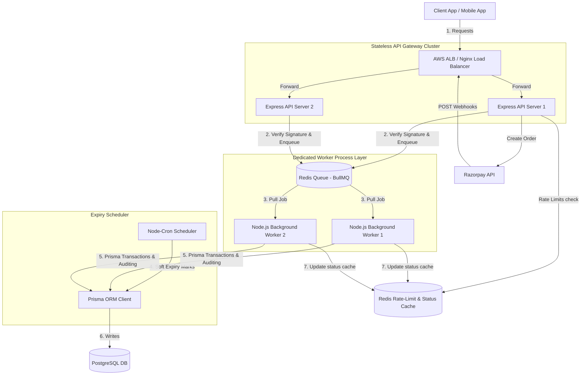
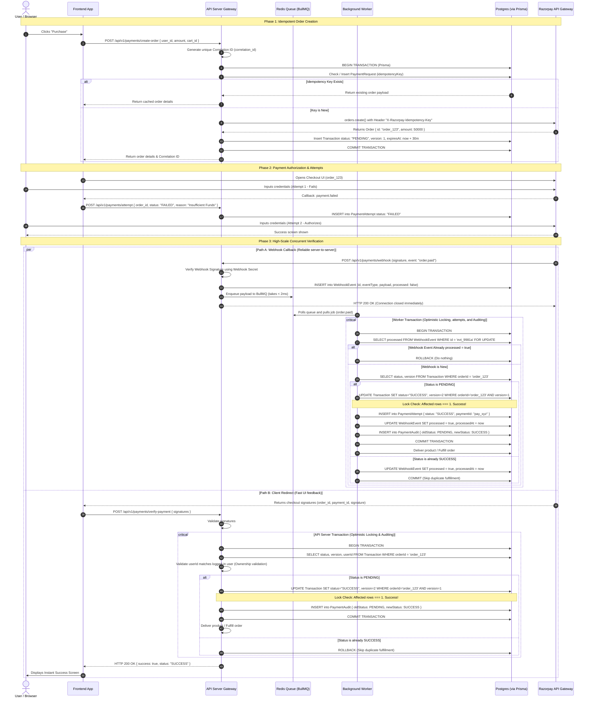

# Production-Grade Multi-Gateway Payment Architecture (1000+ RPS)

This document outlines the final enterprise-ready payment integration design. It addresses idempotency, race conditions, webhook retry guarantees, concurrency locks, transaction auditing, structured logging, rate limiting, and multi-gateway scalability using **Prisma Client** and **BullMQ**.

---

## Table of Contents
1. [High-Level System Topology](#1-high-level-system-topology)
2. [Complete Sequence & Lifecycle Flow](#2-complete-sequence--lifecycle-flow)
3. [Production Database Schema (Prisma)](#3-production-database-schema-prisma)
4. [API Endpoints Specifications](#4-api-endpoints-specifications)
5. [Core Architectural Pillars (Deep Dive)](#5-core-architectural-pillars-deep-dive)
   * [5.1. Idempotency & Retry-Safety](#51-idempotency--retry-safety)
   * [5.2. Concurrency: Versioned Optimistic Locking](#52-concurrency-versioned-optimistic-locking)
   * [5.3. Webhook Retry, Event Logs & Deduplication](#53-webhook-retry-event-logs--deduplication)
   * [5.4. Database Transaction Isolation Rules](#54-database-transaction-isolation-rules)
   * [5.5. Payment Expiry Lifecycle (Cron)](#55-payment-expiry-lifecycle-cron)
   * [5.6. Webhook Ordering & State Transition Constraints](#56-webhook-ordering--state-transition-constraints)
   * [5.7. Resilient Message Queues & DLQ](#57-resilient-message-queues--dlq)
   * [5.8. Gateway Retry Strategy](#58-gateway-retry-strategy)
   * [5.9. Webhook-Based Async Refund Flow](#59-webhook-based-async-refund-flow)
6. [Webhook Event & State Machine Matrix](#6-webhook-event--state-machine-matrix)
7. [Production Code Blueprints (Prisma + BullMQ)](#7-production-code-blueprints-prisma--bullmq)
   * [7.1. API Gateway Webhook Handler](#71-api-gateway-webhook-handler)
   * [7.2. Asynchronous Payment Processing Worker](#72-asynchronous-payment-processing-worker)
   * [7.3. Expiry Reconciliation Cron Job](#73-expiry-reconciliation-cron-job)
8. [DevOps & Scalability Checklist](#8-devops--scalability-checklist)
   * [8.1. API Route Rate Limiting (Redis)](#81-api-route-rate-limiting-redis)
   * [8.2. Prometheus/Grafana Performance Metrics](#82-prometheusgrafana-performance-metrics)
9. [Modular Directory Structure (`payments/`)](#9-modular-directory-structure-payments)
10. [Detailed Component Responsibilities](#10-detailed-component-responsibilities)

---

## 1. High-Level System Topology

To handle 1000+ Requests Per Second (RPS) reliably, the payment infrastructure splits the database-heavy operations out of the client request cycle into separate microservices using a message queue.



---

## 2. Complete Sequence & Lifecycle Flow

This diagram details the transaction lifecycle, illustrating multi-attempt checkouts, database transaction boundaries, and version checks:



---

## 3. Production Database Schema (Prisma)

This database model maps the payment attempts history, webhook logs, soft deletes, unique constraints, and refund states.

```prisma
datasource db {
  provider = "postgresql"
  url      = env("DATABASE_URL")
}

generator client {
  provider = "prisma-client-js"
}

enum PaymentStatus {
  PENDING
  PROCESSING
  SUCCESS
  FAILED
  REFUNDED
  EXPIRED
}

enum PaymentGateway {
  RAZORPAY
  STRIPE
  PAYU
}

model PaymentRequest {
  id             String         @id @default(uuid())
  idempotencyKey String         @unique // Unique index for idempotency protection
  userId         String
  cartId         String
  amount         Decimal        @db.Decimal(10, 2)
  createdAt      DateTime       @default(now())
}

model Transaction {
  id                String             @id @default(uuid())
  userId            String
  orderId           String             @unique // razorpayOrderId
  paymentId         String?            @unique // razorpayPaymentId
  amount            Decimal            @db.Decimal(10, 2)
  status            PaymentStatus      @default(PENDING)
  gateway           PaymentGateway     @default(RAZORPAY)
  version           Int                @default(1) // Version counter for optimistic locking
  expiresAt         DateTime           // Expiration timestamp for pending checkouts
  deletedAt         DateTime?          // Soft delete column
  createdAt         DateTime           @default(now())
  updatedAt         DateTime           @updatedAt
  attempts          PaymentAttempt[]
  audits            PaymentAudit[]
  refunds           Refund[]
  processedWebhooks ProcessedWebhook[]

  @@index([orderId])
  @@index([paymentId])
  @@index([userId, status])
}

model PaymentAttempt {
  id                String      @id @default(uuid())
  transactionId     String
  transaction       Transaction @relation(fields: [transactionId], references: [id])
  razorpayPaymentId String?     @unique
  status            String      // FAILED, SUCCESS, PENDING
  failureReason     String?     // Error messages returned from SDK
  createdAt         DateTime    @default(now())
  updatedAt         DateTime    @updatedAt

  @@index([transactionId])
}

model WebhookEvent {
  id          String    @id // razorpay webhook event ID (e.g., evt_123)
  eventType   String    // payment.captured, payment.failed, etc.
  payload     Json
  signature   String
  processed   Boolean   @default(false)
  createdAt   DateTime  @default(now())
  processedAt DateTime?

  @@index([processed])
}

model ProcessedWebhook {
  id            String      @id // Copy of webhook event ID
  transactionId String
  transaction   Transaction @relation(fields: [transactionId], references: [id])
  event         String
  processedAt   DateTime    @default(now())

  @@unique([id, event])
}

model PaymentAudit {
  id            String        @id @default(uuid())
  transactionId String
  transaction   Transaction   @relation(fields: [transactionId], references: [id])
  oldStatus     PaymentStatus
  newStatus     PaymentStatus
  changedBy     String        // System entity or API request user ID
  timestamp     DateTime      @default(now())

  @@index([transactionId])
}

model Refund {
  id            String      @id @default(uuid())
  transactionId String
  transaction   Transaction @relation(fields: [transactionId], references: [id])
  refundId      String      @unique // Razorpay refund ID (e.g., rfnd_123)
  amount        Decimal     @db.Decimal(10, 2)
  status        String      // PENDING, SUCCESS, FAILED
  failureReason String?
  createdAt     DateTime    @default(now())
  updatedAt     DateTime    @updatedAt

  @@index([transactionId])
}
```

---

## 4. API Endpoints Specifications

The architecture exposes the following API routes under the `/api/v1/payments` scope:

| HTTP Method | Route Endpoint | Purpose | Authentication |
| :--- | :--- | :--- | :--- |
| `POST` | `/api/v1/payments/create-order` | Initializes order session at gateway and DB. | Required (JWT) |
| `POST` | `/api/v1/payments/verify-payment` | Client redirect signature authentication. | Required (JWT) |
| `POST` | `/api/v1/payments/webhook` | Receives async event callbacks from Razorpay. | Verification Middleware |
| `POST` | `/api/v1/payments/attempt` | Records individual success/failed payment attempts. | Required (JWT) |
| `GET` | `/api/v1/payments/status/:orderId` | Checks status of a payment via Redis/DB. | Required (JWT) |
| `POST` | `/api/v1/payments/refund` | Initiates refund request for a payment. | Admin/Service (JWT) |
| `GET` | `/api/v1/payments/refund/:refundId` | Retrieves status details of a specific refund. | Admin/Service (JWT) |

---

## 5. Core Architectural Pillars (Deep Dive)

### 5.1. Idempotency & Retry-Safety
The endpoint `create-order` records the client's `idempotency_key` into the `PaymentRequest` table within a transaction block. If the key already exists, the server returns the cached response, preventing duplicate calls to the Razorpay API.

### 5.2. Concurrency: Versioned Optimistic Locking
Optimistic Locking prevents lock contention by executing conditional updates on the `version` field:
```javascript
const updated = await prisma.transaction.updateMany({
  where: { id: transactionId, version: currentVersion, status: "PENDING" },
  data: { status: "SUCCESS", version: { increment: 1 } }
});
```
If `updated.count === 0`, it indicates that the transaction state was modified by a concurrent thread, halting execution to prevent duplicate fulfillment.

### 5.3. Webhook Retry, Event Logs & Deduplication
To ensure message delivery, all incoming webhook payloads are buffered into the `WebhookEvent` table before processing. If Razorpay retries a webhook, the unique constraint checks status flags to ensure events are processed exactly once.

### 5.4. Database Transaction Isolation Rules
Every operation writing status transitions, audit logs, and payment attempts must run inside a `prisma.$transaction()` block. If any query inside the transaction fails, all updates roll back, ensuring database integrity.

### 5.5. Payment Expiry Lifecycle (Cron)
Orders cannot remain in the `PENDING` state indefinitely. A background scheduler runs every 5 minutes, querying for transaction records where `expiresAt < now()` and transitioning them to `EXPIRED`, which releases reserved stock.

### 5.6. Webhook Ordering & State Transition Constraints
Network latency can cause webhooks to arrive out of order (e.g., `payment.failed` arriving after `payment.captured`). To prevent corrupted data states, transitions are restricted via the following state transition rules:

```
[ PENDING ] ──────> [ SUCCESS ] ──────> [ REFUNDED ]
    │                      
    ├─────────────> [ FAILED ]
    │                      
    └─────────────> [ EXPIRED ]
```

* **Transition Rule:** Transactions in state `SUCCESS` or `REFUNDED` must never transition to `FAILED` or `EXPIRED`. Any update trying to violate these transition rules must be rejected by the service layer.

### 5.7. Resilient Message Queues & DLQ
BullMQ is configured with a **Dead Letter Queue (DLQ)**. If a background job fails (e.g., due to downstream database locks), the queue retries the job up to 5 times using exponential backoff. If all attempts fail, the job is moved to the `failed-jobs` DLQ bucket for manual review and replay processing.

### 5.8. Gateway Retry Strategy
API calls communicating directly with the Razorpay SDK (such as order creation, refund triggers, and status fetches) are wrapped in transient retry loops:
* **Strategy:** Up to 3 retries using exponential backoff (delay: 1s, 2s, 4s). This handles transient network hiccups without breaking client flows.

### 5.9. Webhook-Based Async Refund Flow
Refunds in production are asynchronous operations. The system manages three webhook events to track the refund lifecycle:
1. `refund.created`: Triggered when the refund is initiated. Updates refund record status in the database to `PENDING`.
2. `refund.processed`: Triggered when the refund succeeds. Updates status to `SUCCESS` and revokes user access permissions.
3. `refund.failed`: Triggered if the refund is declined. Updates status to `FAILED`, registers the `failureReason`, and alerts support.

---

## 6. Webhook Event & State Machine Matrix

| Webhook Event | Target Database Status | Validation Step | Actions & Side Effects |
| :--- | :--- | :--- | :--- |
| `order.paid` / `payment.captured` | `SUCCESS` | Check if webhook event already processed; enforce `PENDING` transition constraint. | Optimistic Lock Update, update status to `SUCCESS`, deliver product, update Redis status cache. |
| `payment.failed` | `FAILED` | Validate current status is `PENDING`. Reject if status is `SUCCESS`. | Update status to `FAILED`, release stock reservations, notify user. |
| `payment.authorized` | `PROCESSING` | Verify payment amount matches order. | Set status to `PROCESSING` (manual capture state). |
| `refund.created` | `PROCESSING` | Enforce original transaction status is `SUCCESS`. | Create pending `Refund` database record. |
| `refund.processed` | `REFUNDED` | Match original transaction payment ID. | Update database `Refund` status to `SUCCESS`, update transaction status to `REFUNDED`, revoke access. |
| `refund.failed` | `FAILED` (Refund) | Match original transaction payment ID. | Update database `Refund` status to `FAILED`, log error, notify support. |

---

## 7. Production Code Blueprints (Prisma + BullMQ)

### 7.1. API Gateway Webhook Handler

```javascript
import crypto from "crypto";
import Queue from "bull";
import { PrismaClient } from "@prisma/client";
import { pino } from "pino";

const prisma = new PrismaClient();
const logger = pino({ level: "info" });
const paymentQueue = new Queue("payment-processing", process.env.REDIS_URL);

export const handleRazorpayWebhookHighScale = async (req, res) => {
  const correlationId = req.headers["x-correlation-id"] || `corr_webhook_${Date.now()}`;
  const signature = req.headers["x-razorpay-signature"];
  const eventId = req.headers["x-razorpay-event-id"];
  const secret = process.env.RAZORPAY_WEBHOOK_SECRET;

  const logContext = { correlationId, eventId };

  try {
    const rawBody = req.body.toString("utf-8");
    const expectedSignature = crypto
      .createHmac("sha256", secret)
      .update(rawBody)
      .digest("hex");

    const isAuthentic = crypto.timingSafeEqual(
      Buffer.from(signature, "utf-8"),
      Buffer.from(expectedSignature, "utf-8")
    );

    if (!isAuthentic) {
      logger.warn(logContext, "Unauthorized webhook signature attempt.");
      return res.status(400).send("Unauthorized Webhook Request");
    }

    const payload = JSON.parse(rawBody);

    // 1. Transaction: Write payload directly to WebhookEvent table to secure audit logs
    await prisma.webhookEvent.create({
      data: {
        id: eventId,
        eventType: payload.event,
        payload: payload.payload,
        signature,
        processed: false
      }
    });

    // 2. Enqueue job into BullMQ for background worker execution
    await paymentQueue.add(
      { 
        event: payload.event, 
        data: payload.payload, 
        eventId,
        correlationId
      },
      { 
        attempts: 5,
        backoff: { type: "exponential", delay: 1000 },
        jobId: eventId // Queue-level deduplication
      }
    );

    logger.info(logContext, "Webhook payload enqueued successfully.");
    return res.status(200).send("Queued");
  } catch (error) {
    logger.error({ ...logContext, error: error.message }, "Webhook ingestion error.");
    return res.status(500).send("Internal Server Error");
  }
};
```

---

### 7.2. Asynchronous Payment Processing Worker

```javascript
import Queue from "bull";
import { PrismaClient } from "@prisma/client";
import Redis from "ioredis";
import { pino } from "pino";

const prisma = new PrismaClient();
const redis = new Redis(process.env.REDIS_URL);
const logger = pino({ level: "info" });
const paymentQueue = new Queue("payment-processing", process.env.REDIS_URL);

paymentQueue.process(async (job) => {
  const { event, data, eventId, correlationId } = job.data;
  const logContext = { jobId: job.id, eventId, correlationId, event };

  try {
    // 1. Transaction wrapping webhook validation & optimistic updates
    await prisma.$transaction(async (tx) => {
      
      // A. Check webhook retry deduplication using database lock
      const webhookRecord = await tx.webhookEvent.findUnique({
        where: { id: eventId }
      });

      if (!webhookRecord || webhookRecord.processed) {
        logger.info(logContext, "Webhook event already processed. Skipping.");
        return;
      }

      if (event === "order.paid" || event === "payment.captured") {
        const paymentEntity = data.payment.entity;
        const orderId = paymentEntity.order_id;
        const paymentId = paymentEntity.id;

        // Fetch current transaction state
        const transaction = await tx.transaction.findUnique({
          where: { orderId }
        });

        if (!transaction) {
          throw new Error(`Transaction matching orderId ${orderId} not found.`);
        }

        // Webhook Ordering Check: Reject success -> failed / success transitions
        if (transaction.status === "SUCCESS") {
          await tx.webhookEvent.update({
            where: { id: eventId },
            data: { processed: true, processedAt: new Date() }
          });
          logger.info(logContext, "Transaction status is already SUCCESS. Skipping.");
          return;
        }

        // Apply Optimistic Lock: check status, version and transaction ID
        const updateResult = await tx.transaction.updateMany({
          where: {
            id: transaction.id,
            version: transaction.version,
            status: "PENDING"
          },
          data: {
            status: "SUCCESS",
            paymentId: paymentId,
            version: { increment: 1 }
          }
        });

        if (updateResult.count === 1) {
          // Record payment attempt
          await tx.paymentAttempt.create({
            data: {
              transactionId: transaction.id,
              razorpayPaymentId: paymentId,
              status: "SUCCESS"
            }
          });

          // Mark webhook event as processed
          await tx.webhookEvent.update({
            where: { id: eventId },
            data: { processed: true, processedAt: new Date() }
          });

          // Register webhook logs deduplication
          await tx.processedWebhook.create({
            data: { id: eventId, transactionId: transaction.id, event }
          });

          // Write audit log trail
          await tx.paymentAudit.create({
            data: {
              transactionId: transaction.id,
              oldStatus: "PENDING",
              newStatus: "SUCCESS",
              changedBy: "WEBHOOK_WORKER"
            }
          });

          // Write-Through status caching for client polling
          await redis.setex(`payment:status:${orderId}`, 3600, JSON.stringify({
            status: "SUCCESS",
            paymentId
          }));

          logger.info(logContext, "Transaction processed successfully.");
          
          // TODO: Call product delivery logic safely
        } else {
          throw new Error("Lock Contention Failure: Version updated by another thread.");
        }
      }

      // Handle async refunds
      if (event === "refund.processed") {
        const refundEntity = data.refund.entity;
        const paymentId = refundEntity.payment_id;

        const transaction = await tx.transaction.findUnique({
          where: { paymentId }
        });

        if (transaction && transaction.status === "SUCCESS") {
          await tx.transaction.update({
            where: { id: transaction.id },
            data: { status: "REFUNDED" }
          });

          await tx.refund.upsert({
            where: { refundId: refundEntity.id },
            update: { status: "SUCCESS" },
            create: {
              transactionId: transaction.id,
              refundId: refundEntity.id,
              amount: refundEntity.amount / 100,
              status: "SUCCESS"
            }
          });

          await tx.webhookEvent.update({
            where: { id: eventId },
            data: { processed: true, processedAt: new Date() }
          });

          await tx.paymentAudit.create({
            data: {
              transactionId: transaction.id,
              oldStatus: "SUCCESS",
              newStatus: "REFUNDED",
              changedBy: "WEBHOOK_WORKER"
            }
          });

          await redis.setex(`payment:status:${transaction.orderId}`, 3600, JSON.stringify({ status: "REFUNDED" }));
          logger.info(logContext, "Refund processed successfully.");
        }
      }
    });

  } catch (error) {
    logger.error({ ...logContext, error: error.message }, "Background job execution failed.");
    throw error; // Propagates failure to trigger BullMQ retry logic
  }
});
```

---

### 7.3. Expiry Reconciliation Cron Job

```javascript
import cron from "node-cron";
import { PrismaClient } from "@prisma/client";
import Redis from "ioredis";
import { pino } from "pino";

const prisma = new PrismaClient();
const redis = new Redis(process.env.REDIS_URL);
const logger = pino({ level: "info" });

cron.schedule("*/5 * * * *", async () => {
  logger.info("Starting stale transaction expiry sweep...");

  try {
    const expiredTransactions = await prisma.transaction.findMany({
      where: {
        status: "PENDING",
        expiresAt: { lt: new Date() }
      }
    });

    for (const txn of expiredTransactions) {
      await prisma.$transaction(async (tx) => {
        const updateResult = await tx.transaction.updateMany({
          where: {
            id: txn.id,
            status: "PENDING"
          },
          data: {
            status: "EXPIRED"
          }
        });

        if (updateResult.count === 1) {
          await tx.paymentAudit.create({
            data: {
              transactionId: txn.id,
              oldStatus: "PENDING",
              newStatus: "EXPIRED",
              changedBy: "CRON_EXPIRY_ENGINE"
            }
          });

          await redis.setex(`payment:status:${txn.orderId}`, 3600, JSON.stringify({ status: "EXPIRED" }));
          logger.info({ orderId: txn.orderId }, "Stale payment order expired.");
          
          // TODO: Release reserved stock
        }
      });
    }
  } catch (error) {
    logger.error({ error: error.message }, "Error during transaction expiry sweep.");
  }
});
```

---

## 8. DevOps & Scalability Checklist

### 8.1. API Route Rate Limiting (Redis)
To protect endpoints from brute-forcing and client-side abuse, deploy **express-rate-limit** with **rate-limit-redis** in front of your gateway endpoints:

```javascript
import rateLimit from "express-rate-limit";
import RedisStore from "rate-limit-redis";
import Redis from "ioredis";

const redisClient = new Redis(process.env.REDIS_URL);

export const paymentRateLimiter = rateLimit({
  store: new RedisStore({
    sendCommand: (...args) => redisClient.call(...args),
  }),
  windowMs: 15 * 60 * 1000, // 15 minutes window
  max: 100, // Limit each IP to 100 requests per window
  message: {
    success: false,
    message: "Too many payment requests from this IP. Please try again later."
  }
});
```

Apply this middleware to endpoints in `router.js`:
* `POST /api/v1/payments/create-order`
* `POST /api/v1/payments/verify-payment`
* `POST /api/v1/payments/refund`
* `POST /api/v1/payments/webhook`

---

### 8.2. Prometheus/Grafana Performance Metrics
Expose Prometheus counters on background worker processes and API gateways to monitor execution health:

* `payment_created_total`: Counter tracking total payment orders initialized.
* `payment_success_total`: Counter tracking successful transactions.
* `payment_failed_total`: Counter tracking payment failures.
* `refund_success_total`: Counter tracking processed refunds.
* `webhook_failed_total`: Counter tracking invalid signature webhooks.

---

## 9. Modular Directory Structure (`payments/`)

For a clean Controller → Service → Repository → Prisma configuration that is decoupled and ready for multi-gateway extensions, the `payments/` module is organized as follows:

```text
payments/
│
├── router.js                           # Maps Express routes to Controllers
│
├── controllers/                        # Handles HTTP layer inputs/outputs (request/response)
│   ├── create-order.controller.js
│   ├── verify-payment.controller.js
│   ├── payment-status.controller.js
│   ├── refund.controller.js
│   └── webhook.controller.js
│
├── services/                           # Orchestrates domain business logic
│   ├── create-order.service.js
│   ├── verify-payment.service.js
│   ├── payment-status.service.js
│   ├── refund.service.js
│   ├── webhook.service.js
│   └── reconciliation.service.js
│
├── repositories/                       # Directly communicates with Prisma ORM
│   ├── order.repository.js
│   ├── payment.repository.js
│   ├── refund.repository.js
│   ├── webhook.repository.js
│   └── audit.repository.js
│
├── validations/                        # Zod payload validation schemas
│   ├── create-order.validation.js
│   ├── verify-payment.validation.js
│   ├── refund.validation.js
│   └── webhook.validation.js
│
├── middleware/                         # Modular Express middlewares
│   ├── webhook-signature.middleware.js # Decodes/Validates incoming headers
│   ├── payment-owner.middleware.js     # Validates logged-in user is record owner
│   └── idempotency.middleware.js       # Blocks duplicate payload operations
│
├── dto/                                # Data Transfer Objects for sanitized output
│   ├── order-response.dto.js
│   ├── payment-response.dto.js
│   ├── refund-response.dto.js
│   └── webhook-response.dto.js
│
├── constants/                          # System constants (e.g. Status, Events)
│   ├── payment-status.constants.js
│   ├── refund-status.constants.js
│   ├── webhook-events.constants.js
│   └── gateway.constants.js
│
├── events/                             # Domain events published upon changes
│   ├── payment-success.event.js
│   ├── payment-failed.event.js
│   ├── refund-success.event.js
│   └── refund-failed.event.js
│
├── jobs/                               # Queue job blueprints (BullMQ configs)
│   ├── payment-retry.job.js
│   ├── payment-expiry.job.js
│   ├── refund-retry.job.js
│   └── reconciliation.job.js
│
├── failed-jobs/                        # Failed jobs DLQ (Dead Letter Queue) processing
│   └── dlq-handler.js
│
├── utils/                              # Standalone utility helpers
│   ├── razorpay.util.js
│   ├── signature.util.js
│   ├── amount.util.js
│   ├── currency.util.js
│   └── idempotency.util.js
│
├── workers/                            # Queue consumers for async processing
│   ├── payment.worker.js
│   ├── refund.worker.js
│   └── webhook.worker.js
│
├── integrations/                       # Gateway-specific code (Razorpay/Stripe wrapper)
│   └── razorpay/
│       ├── razorpay.client.js
│       ├── razorpay-order.js
│       ├── razorpay-refund.js
│       └── razorpay-webhook.js
│
├── audit/                              # Transaction audit log services
│   ├── payment-audit.service.js
│   └── payment-audit.dto.js
│
└── docs/                               # Developer markdown references
    ├── payment-flow.md
    ├── webhook-flow.md
    └── refund-flow.md
```

---

## 10. Detailed Component Responsibilities

### A. Routing (`router.js`)
* Maps incoming HTTP requests to their respective controller functions (e.g., `router.post("/create-order")`).
* **Restriction:** Must not contain business logic, direct Prisma calls, or third-party SDK variables.

### B. Controllers (`controllers/`)
* Entry points for the application. Extracts HTTP request body, query parameters, and headers, validates inputs via validators, delegates business execution to the Services layer, and formats output through DTOs.
* **Restriction:** Must not communicate with Prisma directly or perform core transaction operations.

### C. Services (`services/`)
* Orchestrates business rules. For example, `create-order.service` verifies user permissions, computes cart totals, calls the Gateway Integration wrapper, updates order status, and triggers notification jobs.
* **Restriction:** Keeps business rules decoupled from specific HTTP request/response payloads.

### D. Repositories (`repositories/`)
* Data access layer containing raw Prisma Client database queries (e.g., `tx.transaction.updateMany()`, `tx.paymentAudit.create()`).
* **Restriction:** Must not contain business logic, JWT references, or payment gateway APIs.

### E. Middlewares (`middleware/`)
* Handles cross-cutting concerns:
  * `webhook-signature.middleware.js`: Calculates raw HMAC SHA-256 validation before hitting the webhook controller.
  * `payment-owner.middleware.js`: Compares JWT user context against target database row records.
  * `idempotency.middleware.js`: Validates idempotency headers and returns cached results.

### F. Integrations (`integrations/`)
* Houses all SDK code specific to third-party providers. If a future migration to Stripe is required, Stripe integration wrappers are added here without modifying the core Services or Repositories layers.
