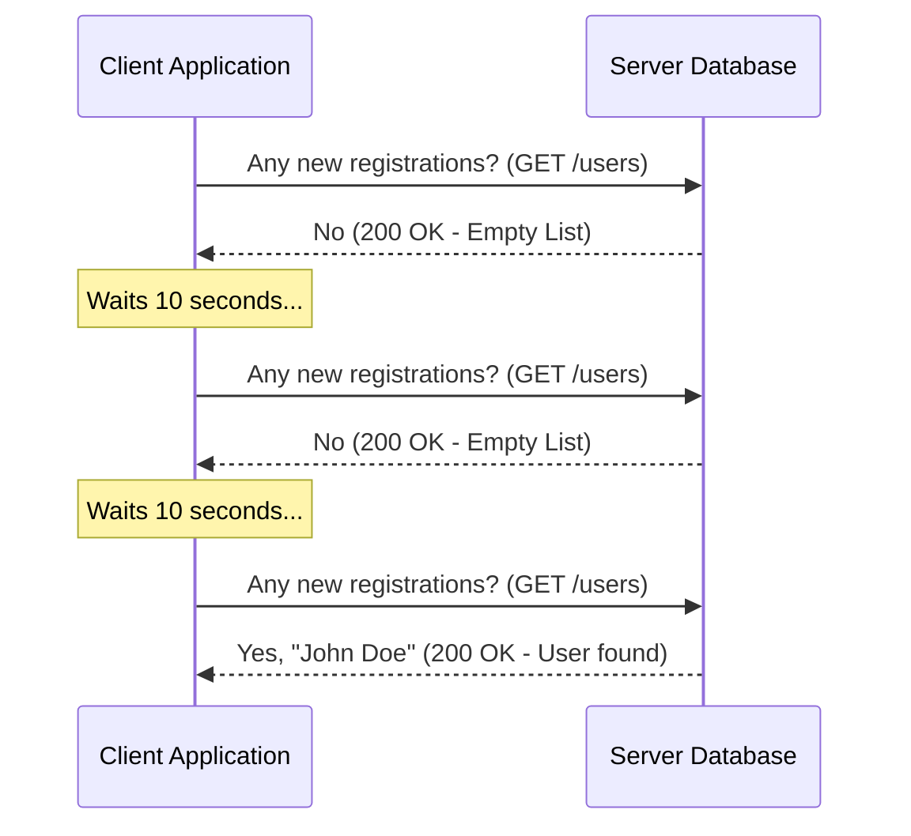
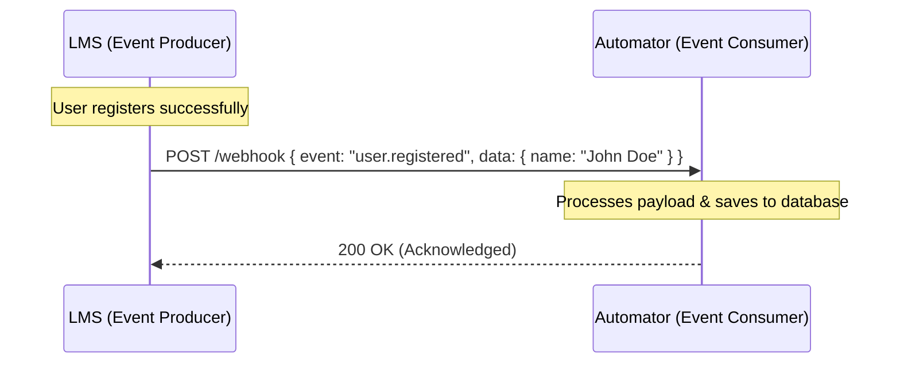
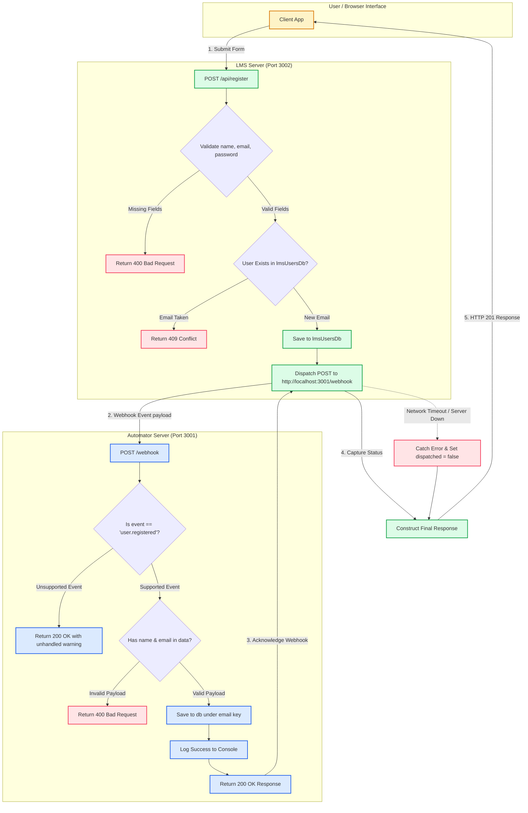
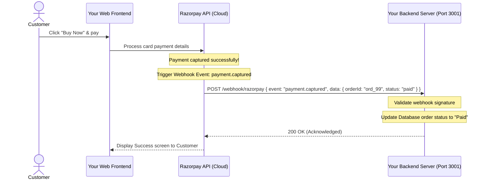

# The Ultimate Guide to Webhooks & Event-Driven Architecture

Welcome! This guide is designed to explain webhooks from the absolute basics up to production-grade patterns. Whether you are a beginner or looking to scale your infrastructure, this document will help you understand, build, and test webhook-based systems.

---

## Table of Contents
1. [Webhooks for Beginners: The Mailbox Analogy](#1-webhooks-for-beginners-the-mailbox-analogy)
2. [What is a Webhook? (Polling vs. Webhooks)](#2-what-is-a-webhook-polling-vs-webhooks)
3. [LMS & Automator: Our Microservices Flow](#3-lms--automator-our-microservices-flow)
4. [Real-World Webhooks: Razorpay/Stripe Payment Gateway Integration](#4-real-world-webhooks-razorpaystripe-payment-gateway-integration)
5. [Local Testing: Exposing Localhost to the Public Internet (Localtunnel/ngrok)](#5-local-testing-exposing-localhost-to-the-public-internet-localtunnelngrok)
6. [Production Best Practices (Security, Retries, Idempotency)](#6-production-best-practices-security-retries-idempotency)

---

## 1. Webhooks for Beginners: The Mailbox Analogy

If you are new to webhooks, think of them like getting physical mail at your house:

*   **Polling (The Old Way)**: Imagine walking down to your mailbox at the end of the street every 5 minutes to check if a letter has arrived. Most of the time, you walk back empty-handed. It is tiring, wastes time, and uses unnecessary energy.
*   **Webhook (The Modern Way)**: Imagine instead that the postman walks up to your house and **rings your doorbell** as soon as a letter arrives. You only go to the door when you hear the ring. This is a webhook! Your server waits quietly until another server "rings its doorbell" (sends an HTTP POST request) with new data.

```
Polling (Pull)  : [You] ------------ (Every 5 mins: "Any mail?") ------------> [Mailbox]
Webhook (Push)  : [You] <--- (Ding Dong! "You've got mail!" HTTP POST) ------ [Postman]
```

---

## 2. What is a Webhook? (Polling vs. Webhooks)

A **Webhook** is an automated HTTP POST request sent by a source server (the **Producer**) to a destination server (the **Consumer**) when a specific event occurs.

| Feature | Polling (Pull) | Webhooks (Push) |
| :--- | :--- | :--- |
| **Initiator** | Client repeatedly asks: "Any new data?" | Server pushes data immediately when an event occurs. |
| **Network Cost**| High. Generates hundreds of empty, wasteful requests. | Low. Only sends a request when actual data is ready. |
| **Real-time** | Delayed (depends on how frequently you poll). | Real-time. The transfer happens immediately. |

#### Polling Flow (Pull)


#### Webhook Flow (Push)


---

## 3. LMS & Automator: Our Microservices Flow

In this project, we set up two independent microservices running in a Monorepo:
1.  **LMS Server** (Port 3002) - The **Producer** (detects registration, fires the webhook).
2.  **Automator Server** (Port 3001) - The **Consumer** (listens for the webhook, stores data).

### Detailed Workflow Flowchart
This diagram illustrates the step-by-step logic, validation checkpoints, and error handling paths inside the codebase:



---

## 4. Real-World Webhooks: Razorpay/Stripe Payment Gateway Integration

In the real world, you do not write both servers. Instead, your backend acts as the **Consumer** (like our Automator server), and a third-party service like **Razorpay** or **Stripe** acts as the **Producer**.

### Real-World Payment Flow

When a customer pays on your website:
1.  The payment goes through Razorpay's secure systems.
2.  Razorpay's server generates a secure `payment.captured` event.
3.  Razorpay triggers a webhook calling your backend API endpoint to update the database (e.g. mark the order as paid, send an invoice email).



### Implementing a Razorpay Webhook Handler in Node.js

Below is an example of how you would write an endpoint on your server to handle Razorpay's webhook safely:

```javascript
const express = require('express');
const crypto = require('crypto');
const app = express();

app.use(express.json());

const RAZORPAY_SECRET = 'your_razorpay_webhook_secret_key';

app.post('/webhook/razorpay', (req, res) => {
  // 1. Get signature from Razorpay header
  const signature = req.headers['x-razorpay-signature'];
  const rawBody = JSON.stringify(req.body);

  // 2. Verify the webhook signature to ensure it actually came from Razorpay
  const expectedSignature = crypto
    .createHmac('sha256', RAZORPAY_SECRET)
    .update(rawBody)
    .digest('hex');

  if (signature !== expectedSignature) {
    console.error('❌ Invalid signature. Webhook rejected.');
    return res.status(400).send('Invalid signature');
  }

  // 3. Process the webhook payload
  const { event, payload } = req.body;
  console.log(`✅ Webhook verified! Event received: ${event}`);

  if (event === 'payment.captured') {
    const paymentDetails = payload.payment.entity;
    const orderId = paymentDetails.order_id;
    const amount = paymentDetails.amount / 100; // converted from paise to rupees

    console.log(`💰 Payment of ₹${amount} captured for Order: ${orderId}`);
    
    // Update order status in your database here...
  }

  // 4. Always return a 200 OK status to Razorpay quickly
  res.status(200).send('OK');
});
```

---

## 5. Local Testing: Exposing Localhost to the Public Internet (Localtunnel/ngrok)

### The Problem
During development, your server is running on `http://localhost:3001`. 
Because `localhost` is private to your computer, cloud services like Razorpay or Stripe cannot send requests to it. They will get a connection timeout error.

```
[Razorpay Cloud Server] -------------- (Cannot reach localhost!) ------------> [http://localhost:3001]
```

### The Solution: Tunnels
A tunneling tool (like **Localtunnel** or **ngrok**) creates a secure, public URL (e.g. `https://happy-cat-jump.loca.lt`) on the internet and forwards all traffic sent to that URL directly to your private `localhost:3001` port.

```
[Razorpay Cloud] 
       │
       ▼ (Sends HTTP POST)
[https://happy-cat-jump.loca.lt]   <-- Public Endpoint
       │
       ▼ (Secure tunnel forwards traffic)
[http://localhost:3001]             <-- Your local computer
```

### Step-by-Step Tunnel Setup Guide

We will use **Localtunnel** since it is free and does not require registration.

#### Step 1: Start your local server
Make sure your local webhooks servers are up and running:
```bash
pnpm start
```
*(Your Automator server should be running on Port 3001)*

#### Step 2: Open a public tunnel
In a new terminal window, run the following command to expose your Automator server (Port 3001):
```bash
npx localtunnel --port 3001
```

#### Step 3: Get your public URL
The command will print a public URL, for example:
```
your url is: https://funny-monkeys-cry.loca.lt
```

#### Step 4: Configure Razorpay / Stripe
1. Go to your Razorpay Dashboard -> Webhooks Settings.
2. Paste the public URL into the **Webhook URL** field:
   `https://funny-monkeys-cry.loca.lt/webhook`
3. Select the events you want to listen to (e.g. `payment.captured`).
4. Save the webhook settings.
5. Trigger a test payment. You will see the incoming webhook logged in your local terminal window!

---

## 6. Production Best Practices

*   **Always Verify Signatures**: Never trust incoming payloads blindly. Verify HMAC signatures to ensure the requests are authentic.
*   **Respond Quickly (2xx Status)**: Webhook producers have short timeout limits (often 3 to 5 seconds). Acknowledge with a `200 OK` status immediately, and perform heavy/long processes (like generating PDFs or sending emails) asynchronously in a background queue.
*   **Handle Duplicate Deliveries**: Networks are unstable. Ensure your endpoints are **Idempotent** by checking if you have already processed the event using a unique transaction or event ID.
